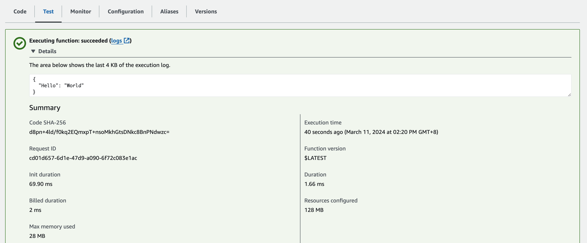

## 初次部署 aws lambda function

「初次部署」時，會有一些事情要預先準備完成。我們不會直接使用 AWS Console 上用 Cloud 9 來編寫 AWS Lambda Function 的程式，得先將這個
Git Repo 內的實作轉成可以部署的型式。 簡單地說，它得被包裝成一個 Zip 檔案並上傳至 AWS S3 內，再透過 AWS Console 指定要部署的
S3 URL。

這裡有一個小細節得注意，AWS Lambda 的 Region 需要與 AWS S3 Bucket 的 Region 一致才行。

### 實作內容

* 需要有一個簡單的 Script 建立 Zip 檔 (參考 [pack-for-lambda.sh](../pack-for-lambda.sh))
* 將 Zip 檔上傳至 AWS S3 之內
* 建立 AWS Lambda Function 指定 handler 為 `stock_info.handler.callback`
* 使用 AWS Console / AWSCLI 實測結果

