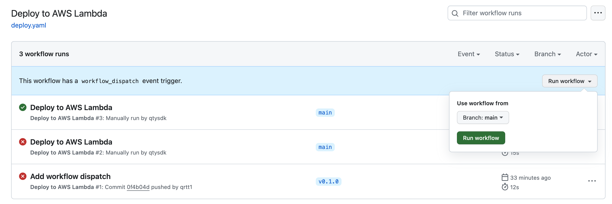

## 自動更新 AWS Lambda

在完成了首回的[手工部署](000_bootstrap_lambda_function.md)後，接續的活動就是讓這個流程自動化。 由於，我們的專案是放在
GitHub 上的，所以使用 GitHub Action 來達到這個目標是相當容易的。

除了準備 Action 使用的設定檔，有些工作項目得做：

* 在 AWS IAM 上建立好適當的 Credential 讓 GitHub Action 可以
    * 上傳 Zip 檔至 S3
    * 對 AWS Lambda 進行更新
    * 對 AWS Lambda 進行呼叫
* GitHub Action 只在 version tag 發生時部署
    * version tag 是指 `v` 起頭的 tag，例如：`v0.1`
    * 為了方便測試，也允許直接「手動」在 workflow 頁面執行

### 手動執行



### 使用 tag 部署

```bash
git tag v0.1.1
git push origin v0.1.1
```